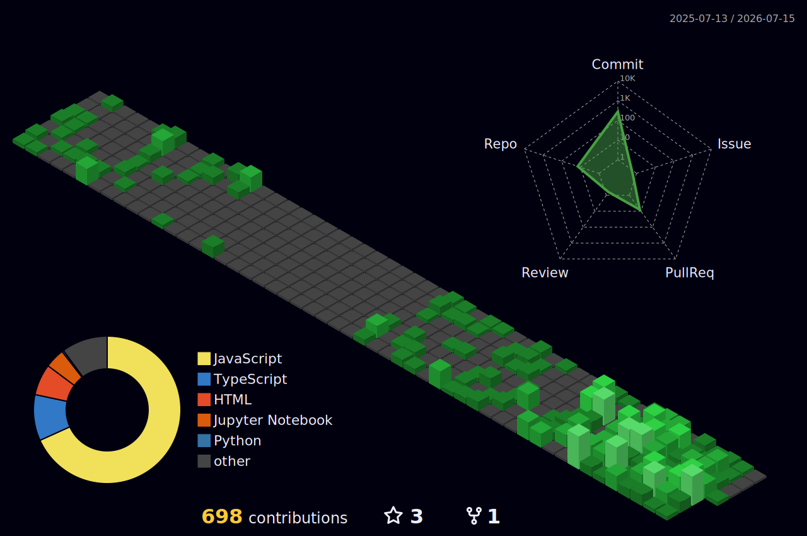

# Arpit Chhabra

**Full Stack Developer · MERN · Real-Time Systems · AI/SaaS**

B.Tech Information Technology @ IIIT Una · Batch 2027

---

## About

I build scalable full-stack systems, real-time applications, and AI-powered SaaS products. Currently working as a **Full Stack Intern at ModelSuite AI** on a live production HR platform, and building **MindClash** — a real-time AI-powered debate platform.

- 🔭 Currently building **MindClash** — real-time AI debate platform with Socket.io, Redis & Gemini AI
- 💼 Full Stack Intern @ **ModelSuite AI** — contributing to live production systems daily
- 🧠 Exploring **RAG pipelines, vector search, semantic chunking & multi-modal AI**
- 🏆 **Top 50 of 5000+** teams — National Road Safety Hackathon (MoRTH)
- 🏆 **Top 4000 of 260,000** — Adobe Hackathon Round 2 Qualifier
- 💡 500+ DSA problems solved across LeetCode, GFG & CodeNinjas
- 📫 **arpitchhabra.work@gmail.com**

---

## Featured Projects

### 🔴 MindClash — AI-Powered Real-Time Debate Platform
> MongoDB · Express.js · React.js · Node.js · Socket.io · Redis · Gemini API · WebRTC · Tailwind CSS

A large-scale real-time debate platform (~8,500 LOC) supporting **1v1, team, and battle-royale** modes. Engineered WebSocket rooms for isolated high-frequency streams with sub-second latency. Integrated Gemini AI as an autonomous judge with JSON-structured prompt engineering for scoring, fact-checking & moderation. Built anonymous alias system, XP/ELO engine, spectator mode, and atomic MongoDB locks to prevent race conditions.

---

### 🔵 CareerCraft AI — SaaS AI Learning & Interview Platform
> MongoDB · Express.js · React.js · Llama-3.3 · Jina AI · RAG · Stripe · Brevo · Framer Motion

A fully deployed SaaS platform with a custom **RAG pipeline** (Jina AI + MongoDB Vector Search + Llama 3.3-70b) for hallucination-resistant document Q&A. Features AI mock interviews, 3D animated flashcard decks, quiz generation, Stripe webhook subscriptions (Free/Pro/Enterprise), and a gamification engine with XP, streaks & global leaderboard. Built with a luxury glassmorphism UI using Framer Motion.

---

### 🟢 StreamSphere — Scalable Video Streaming Backend API
> Node.js · Express.js · MongoDB · Mongoose · JWT · Multer · Cloudinary

High-performance REST backend across **10+ modules** — video uploads, playlists, comments, subscriptions & channel management. Optimized MongoDB aggregation pipelines handling 1,000+ ops with 40% reliability boost. Dual-token JWT auth with bcrypt. Multer + Cloudinary integration cutting upload time by 30%.

---

## Tech Stack

**Languages**

**Frontend**

**Backend & Databases**

**DevOps & Tools**

**AI & SaaS**

**GenAI & RAG**

---

## GitHub Stats

  
  

  

---

## 🏆 GitHub Trophies

  

---

## 📅 Monthly Contribution Activity

  

---

## 🧊 3D Contribution Graph

  

> 💡 To enable the 3D graph, add this GitHub Action: [`.github/workflows/profile-3d.yml`](https://github.com/yoshi389111/github-profile-3d-contrib)

---

## 💬 Dev Quote

  

---

*Open to internships, collaborations, and impactful engineering projects.*

**Let's build something extraordinary together 🚀**

