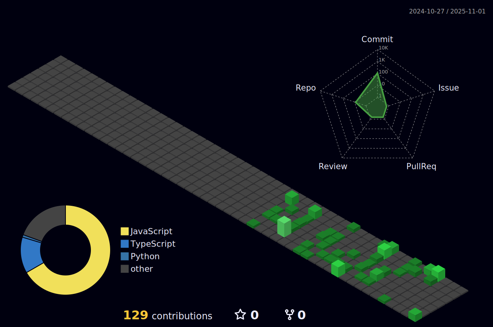

<h1 align="center">Hi 👋, I'm Arpit Chhabra</h1>
<h3 align="center">
B.Tech IT @ IIIT Una | Full Stack Developer (MERN) | Backend & Systems Enthusiast
</h3>

Building scalable web systems, real-time applications, and AI-powered products.

  

---

## 👨‍💻 About Me  

- 🎓 B.Tech Information Technology @ **IIIT Una (CGPA: 8.06 | Batch 2027)**
- 🔭 Currently building **MindClash – AI-powered real-time debate platform**
- 🌱 Learning **system design, backend scalability, caching, and performance optimization**
- 💡 Strong fundamentals in **DSA, OOP, DBMS, Operating Systems, Computer Networks**
- 👯 Open to **internships, open-source, and impactful engineering projects**
- 📫 Reach me at **arpitchhabra.work@gmail.com**

🌐 **Profiles**  
[GitHub](https://github.com/ArpitChhabra23306) •
[LinkedIn](https://linkedin.com/in/arpit-chhabra-7a1a93276) •
[Codolio](https://codolio.com/profile/arpitChhabra)

---

## 🚀 Featured Projects  

### 🧠 MindClash — AI-Powered Real-Time Debate Platform  
**Tech:** React, Node.js, MongoDB, Socket.io, Redis, JWT, Gemini API, WebRTC, Tailwind CSS  

- Built a real-time multi-user debate platform with **sub-second latency**
- Designed **40+ REST APIs** with Redis-based caching and scalable backend architecture
- Integrated **AI for moderation, fact-checking, scoring, and analytics**
- Implemented anonymous debates, spectator mode, and XP-based systems  

🔗 GitHub: *(add repo link)*

---

### 🎯 CareerCraft AI — SaaS Learning & Interview Platform  
**Tech:** MERN Stack, Gemini API, Razorpay, Cloudinary, Tailwind CSS  

- Built a full-stack SaaS platform for **AI-based learning & interview preparation**
- Implemented document-based **AI chats, quizzes, flashcards**
- Designed secure authentication, subscriptions, and usage limits  

🔗 GitHub: *(add repo link)*

---

### 📺 StreamSphere — Scalable Backend API  
**Tech:** Node.js, Express, MongoDB, JWT, Multer, Cloudinary  

- Designed modular backend APIs across **10+ functional modules**
- Optimized DB pipelines handling **1000+ operations**
- Improved authentication reliability by **40%**  

🔗 GitHub: *(add repo link)*

---

## 🛠️ Tech Stack  

### 💻 Programming Languages  

### 🎨 Frontend  

- Responsive UI / UX  
- Animations & Interactions  

---

### ⚙️ Backend & APIs  

- RESTful API Design  
- Authentication & Authorization (JWT, RBAC)  
- Real-time Systems (Socket.io)  

---

### 🗄️ Databases & Caching  

- MongoDB & Mongoose  
- SQL (MySQL)  
- Redis (Caching, State Management)

---

### 🤖 AI, SaaS & Integrations  

---

### 🧰 DevOps & Tools  

---

## 📘 Core CS Foundations  

---

## 📊 GitHub Stats  

  

---

## 📈 Contribution Activity  

  

---

## 🖼️ 3D GitHub Contribution Graph  

---

## 🌐 Connect With Me  

  

